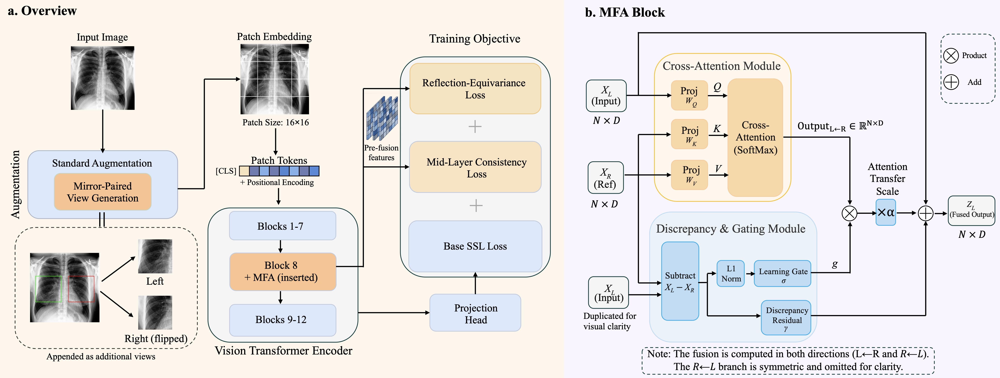

# Mirror-Fusion Attention for Reflection-Aware Self-Supervised Representation Learning

<div align="center">

<a href="https://arxiv.org/pdf/2607.00850">
  
</a>

<a href="https://arxiv.org/abs/2607.00850">
  
</a>

</div>

```bibtex
@misc{li2026mirrorfusion,
      title={Mirror-Fusion Attention for Reflection-Aware Self-Supervised Representation Learning}, 
      author={Ruixin Li and Jin Liu and Yuling Shi and Stefano Lodi},
      year={2026},
      eprint={2607.00850},
      archivePrefix={arXiv},
      primaryClass={cs.CV},
      url={https://arxiv.org/abs/2607.00850}, 
}
```

Official implementation of MFASSL, a reflection-aware add-on for vision self-supervised learning based on Vision Transformers.



## Overview

This repository contains a compact research codebase for:

- MFASSL pretraining with `DINO`, `MoCo-v3`, and `MAE`
- mirror-paired view construction and Mirror-Fusion Attention
- downstream evaluation for classification, segmentation, and landmark localization
- repeated-run aggregation, paired bootstrap testing, and MFA feature-shift measurement

The code is organized around a small set of reusable modules under `mfassl/` and runnable scripts under `scripts/`.

## Repository Layout

```text
mfassl/
  data/          datasets, mirror-pair generation, pretraining transforms
  engine/        config-driven builders, schedules, pretraining loop
  eval/          downstream tasks and evaluation utilities
  losses/        DINO, MoCo-v3, MAE, and symmetry losses
  models/        ViT wrapper and Mirror-Fusion Attention
  utils/         config loading and seeding
scripts/
  pretrain.py
  eval_classification.py
  eval_segmentation.py
  eval_landmark.py
  measure_inference_shift.py
  run_bootstrap.py
configs/
  base.yaml and experiment configs
```

## Installation

Python `3.11+` is required.

```bash
pip install -e .
```

If you want the pinned environment used by this repo, install:

```bash
pip install -r requirements.txt
```

## Configuration

Configs are loaded with OmegaConf and support:

- `base:` inheritance between YAML files
- CLI dotlist overrides such as `pretrain.epochs=100 data.batch_size=64`

The main experiment groups currently included are:

| Dataset | Frameworks | Backbones | Configs |
| --- | --- | --- | --- |
| CheXpert | DINO, MoCo-v3, MAE | ViT-B/16, ViT-S/16 | `configs/*chexpert*.yaml` |
| BraTS + OASIS-3 | DINO, MoCo-v3, MAE | ViT-B/16, ViT-S/16 | `configs/*brats*.yaml` |
| CelebA-HQ | DINO, MoCo-v3, MAE | ViT-B/16 | `configs/*celeba*.yaml` |

## Pretraining

Run pretraining with:

```bash
python scripts/pretrain.py --config <config> [key=value ...]
```

Examples:

```bash
python scripts/pretrain.py --config configs/dino_chexpert_vitb16.yaml \
  data.root=/path/to/CheXpert-v1.0

python scripts/pretrain.py --config configs/dino_brats_vitb16.yaml \
  data.brats_root=/path/to/BraTS2023/TrainingData \
  data.oasis_root=/path/to/OASIS3

python scripts/pretrain.py --config configs/dino_celeba_vitb16.yaml \
  data.root=/path/to/CelebA-HQ
```

Checkpoints are saved to:

```text
<log.out_dir>/checkpoint.pth
```

## Downstream Evaluation

### Classification

```bash
python scripts/eval_classification.py \
  --config configs/dino_chexpert_vitb16.yaml \
  --checkpoint runs/dino_chexpert_vitb16/checkpoint.pth \
  --mode finetune
```

Use `--mode linear` for linear probing. The script reports AUROC, AUPRC, F1, accuracy, NLL, ECE, Brier score, and flip consistency.

### Segmentation

```bash
python scripts/eval_segmentation.py \
  --config configs/dino_brats_vitb16.yaml \
  --checkpoint runs/dino_brats_vitb16/checkpoint.pth
```

The script fine-tunes a lightweight decoder on BraTS slices and reports Dice, HD95, ECE, and NLL.

### Landmark Localization

```bash
python scripts/eval_landmark.py \
  --config configs/dino_celeba_vitb16.yaml \
  --checkpoint runs/dino_celeba_vitb16/checkpoint.pth \
  data.wflw_root=/path/to/WFLW
```

The script reports NME, `AUC@0.1`, `Fail@0.1`, and flip consistency.

### Multi-Seed Runs

All downstream scripts support repeated runs with:

```bash
--seeds 0 1 2
```

They print per-seed results and an aggregated `mean±std` summary.

### Bootstrap Testing

If predictions are saved with `--save-predictions`, metric gaps can be evaluated with:

```bash
python scripts/run_bootstrap.py \
  --baseline /path/to/baseline.npz \
  --mfassl /path/to/mfassl.npz \
  --metric auroc
```

### MFA Feature Shift

```bash
python scripts/measure_inference_shift.py \
  --config configs/dino_chexpert_vitb16.yaml \
  --checkpoint runs/dino_chexpert_vitb16/checkpoint.pth
```

## Dataset Layout

### CheXpert

Set `data.root` to the directory containing `train.csv`, `valid.csv`, and the image paths referenced in the CSV.

### BraTS 2023

Each case directory is expected to contain:

```text
<case>/<case>-t1n.nii.gz
<case>/<case>-t1c.nii.gz
<case>/<case>-t2w.nii.gz
<case>/<case>-t2f.nii.gz
<case>/<case>-seg.nii.gz
```

### OASIS-3

Set `data.oasis_root` to a directory where T1 volumes can be found by the glob pattern:

```text
**/*T1w*.nii.gz
```

### CelebA-HQ

The loader expects:

```text
CelebA-HQ/
  CelebA-HQ-img/
  list_attr_celeba.txt
  CelebA-HQ-to-CelebA-mapping.txt
  identity_CelebA.txt
```

`identity_CelebA.txt` is optional and is only used for identity-aware splitting.

### WFLW

The landmark evaluator expects the standard annotation files such as:

```text
list_98pt_rect_attr_train.txt
list_98pt_rect_attr_test.txt
```

## License

This project is released under the MIT License. See [LICENSE](LICENSE).
